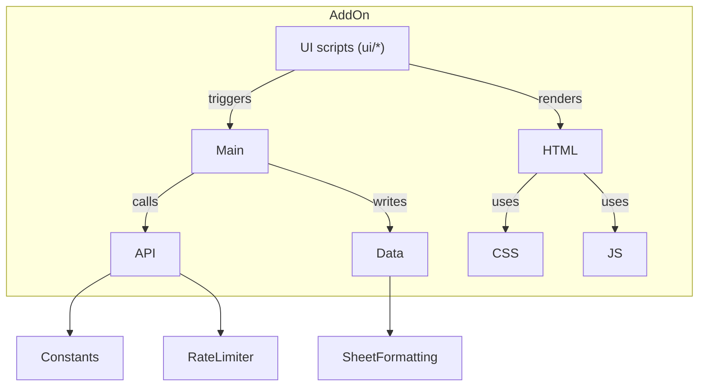

# Project Architecture

This document gives an overview of the portfolio tracker add-on. It summarises the main folders, their responsibilities and the way the code interacts. Coding agents can use this as a reference when extending the project.

## Directory overview

- **api/** – Handles all communication with the Trading212 API. Contains utilities, constants, rate limiting and fetch functions.
- **data/** – Sheet management and formatting helpers. Responsible for writing data retrieved from the API into Google Sheets.
- **html/**, **js/**, **css/** – Templates and client‑side scripts used by modals and other UI dialogs.
- **main/** – Core logic such as progress tracking, caching and common utility functions.
- **ui/** – Builds menus, manages modal dialogs and handles setup interactions.
- **tasks/** – High‑level development notes and feature ideas.

## High level flow

- The **menuBuilder** in `ui/` runs on spreadsheet open and exposes actions.
- UI actions invoke functions in `main/` which orchestrate API calls and progress updates.
- API utilities fetch portfolio data and respect rate limits.
- Data helpers format responses and update sheets.
- Modal dialogs use the HTML/CSS/JS templates under `html/`, `css/` and `js/`.

